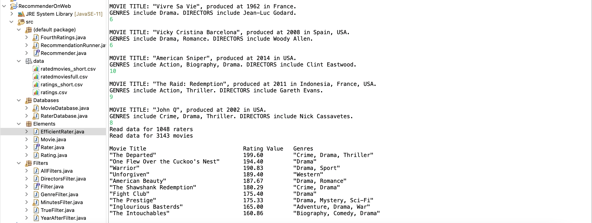
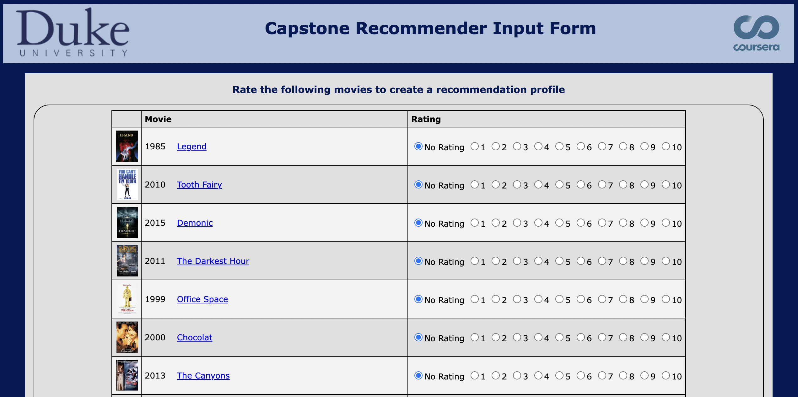

# Recommender

This is the Capstone of Java Programming on Coursera. 

The database used in this project is movie data and rating data. 

How does the recommender work: 

(0) a new user rates 12 movies from 1 to 10. 

(1) finding the most similar users using the dot product metric (because we also care about the magnitude, so it is a better choice than cosine similarity) 

(2) calculating the weighted score for each movie  = importance (similarity) of the rater * his/ her rating of the movie 

(3) ranking movies based on their weighted score, and only showing the first 10 movies.

Option1: interact using the keyboard

Option2: interact with the course site

